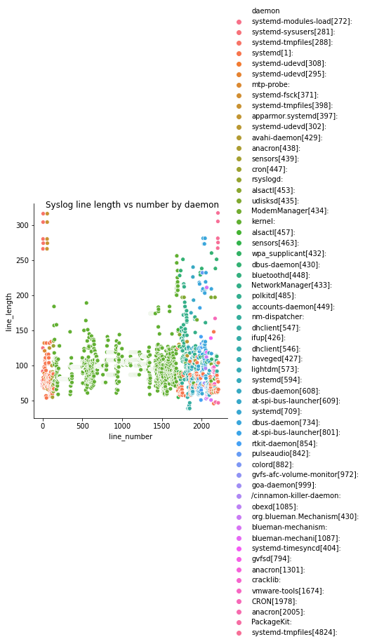

## Syslog to CSV
Uses [Python 3](https://python.org) to convert a [syslog](https://tools.ietf.org/html/rfc5424) file to Comma Separated Values (CSV) format. This has been tested with Debian 10 and AWS Linux but other syslog formats will probably work.

### Install/Setup `syslog-to-csv`
Download and unzip the [latest release](https://github.com/gm3dmo/syslog-to-csv/releases/latest):


### Run `syslog-to-csv.py`
Run `syslog-to-csv.py` to create a `syslog.csv` file:

```
python3 syslog-to-csv.py /var/log/syslog
```

This creates a  `syslog.csv` file in the working directory directory.


#### Using pypy for speed
To process the file much more quickly [pypy](https://www.pypy.org/) can be used instead of python:

```
pypy3 syslog-to-csv.py /var/log/syslog.1
```

#### Next Steps
With the data in CSV format a  wide range of tools like Pandas, Sqlite or Excel can be used to interpret the syslog data. For example, this little chart was created using Pandas:

- Process the csv with [csvkit](https://csvkit.readthedocs.io/en/latest/) to get a summary of it's contents.



